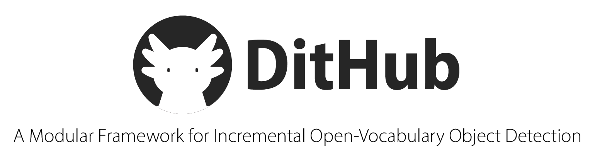
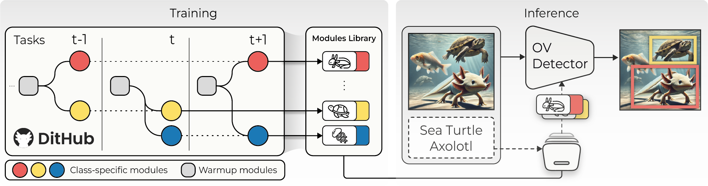

<p align="center">
   &nbsp;
</p>

##

**DitHub** is a modular and scalable framework designed for **Incremental Open-Vocabulary Object Detection**. Inspired by version control systems, DitHub enables the seamless management, update, and composition of **class-specific adaptation modules**.


<p align="center">
  <a href="https://aimagelab.github.io/DitHub">
    
  </a>
  <a href="https://arxiv.org/abs/2503.09271">
    
  </a>
  <br><br>
  
</p>


<br>

## ⚙️ Setup

### Prerequisites

- Python >= 3.9
- CUDA >= 11.8, GCC >= 11.4

### Installation

- Clone the DitHub repository from GitHub and change the current directory
```bash
git clone https://github.com/chiara-cap/DitHub.git
cd DitHub
```

- Create and activate a conda environment
```bash
conda create -n dithub python=3.9 pip
conda activate dithub
```

- Install the requirements
```bash
pip install -r requirements.txt
```

- Clone the Deformable-DETR repository and compile CUDA operators
```bash
git clone https://github.com/fundamentalvision/Deformable-DETR.git

cd Deformable-DETR/models/ops
sh ./make.sh
# unit test (should see all checking is True)
python test.py
```

- Download the pre-trained GroundingDINO model weights to be used as the starting point for training.
```bash
wget -q https://github.com/IDEA-Research/GroundingDINO/releases/download/v0.1.0-alpha/groundingdino_swint_ogc.pth
```

<br>

## 📁 Datasets
To reproduce the experiments in the paper, download the following datasets and place them inside the `datasets/` folder:

- [**COCO**](https://cocodataset.org/#download) — used for **zero-shot evaluation**  
- **ODinW-35** — required because it includes the 13 subsets used in the paper (**ODinW-13**) for **incremental training**

To download **ODinW-35**, run the following script:
```bash
mkdir datasets
cd datasets
python tools/download_odinw.py
```

ℹ️ *Note: ODinW-13 is automatically configured when downloading ODinW-35.*


To test on the **ODinW-O** benchmark (for overlapping classes), after downloading ODinW-35, run:
```bash
python tools/overlapped_classes_dataset.py
```

<br>

## 🚀 Running Dithub

### Training
To start the training process, run the following command. This will use the specified configuration, load the pre-trained checkpoint (if available), and save the outputs in the designated directory:

```bash
sh train_dithub.sh
```

### Evalutation
Before running evaluation, download the pre-trained DitHub model weights:
```bash
wget -q https://github.com/chiara-cap/DitHub/releases/download/v.0.1/model_final.pth
```

Then, to evaluate the model, run:
```bash
sh eval_dithub.sh
```

#### Command Line Arguments
| Parameter                  | Description |
|-----------------------------|-------------|
| `--config-file`             | Path to the training configuration file. |
| `--model-config-file`       | Path to the model architecture configuration file. |
| `--model-checkpoint-path`   | Path to the pre-trained model checkpoint file (Grounding DINO or DitHub). |
| `--output-dir`              | Directory where outputs (logs, checkpoints) will be saved. |
| `--dithub`                  | Flag to integrate Dithub into Grounding DINO. |
| `--eval-only`               | Run the model in evaluation mode without training. |

<br>

## 📜 Citation

If you find **DitHub** useful for your research, please consider citing our paper:

```bibtex
@article{cappellino2025dithub,
   title={DitHub: A Modular Framework for Incremental Open-Vocabulary Object Detection},
   author={Cappellino, Chiara and Mancusi, Gianluca and Mosconi, Matteo and Porrello, Angelo and Calderara, Simone and Cucchiara, Rita},
   journal={arXiv preprint arXiv:2503.09271},
   year={2025}
 }

